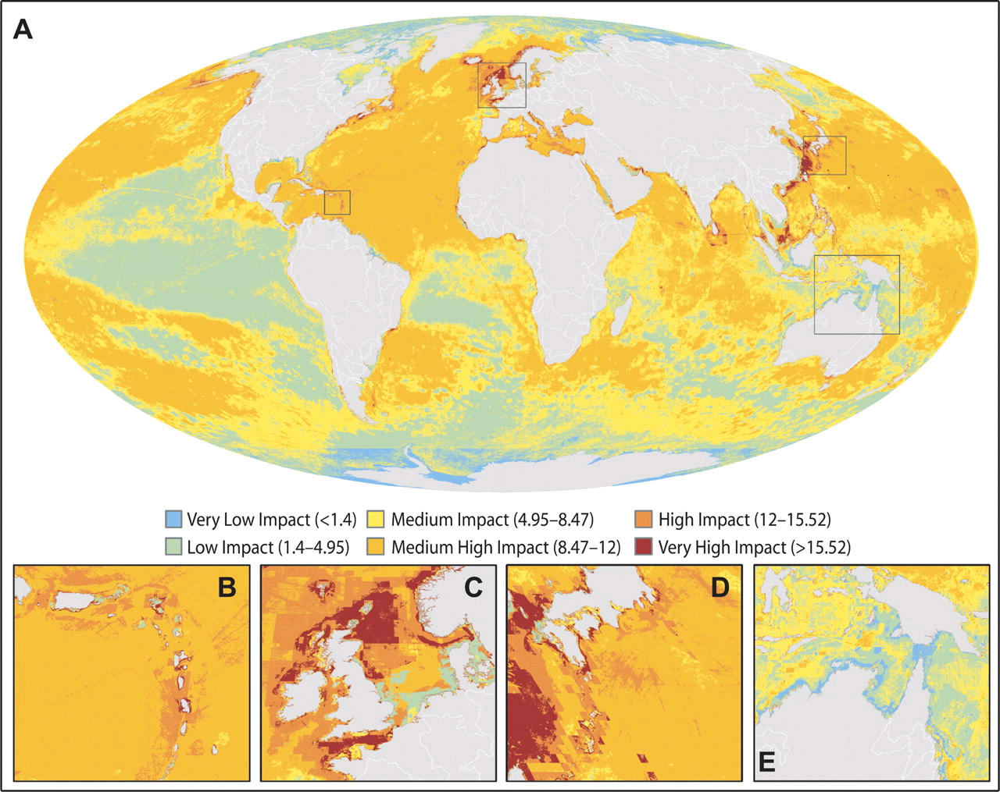

```{r setup, include=FALSE}
knitr::opts_chunk$set(echo = FALSE, warning = FALSE, message = FALSE)
```

# Introduction

Le stage d'écophysiologie des animaux marins s'est déroulé dans la STAtion de REcherches Sous-marine et Océanographique abrégée en STARESO. Cette base scientifique fut fondée en 1972 par l'université de Liège. Elle se localise dans la baie de Calvi en Corse, France (8°45E, 42°35N). La localisation du cette base n'est pas anodine. Le site est considéré comme un site de référence pour la Méditerranée. Ce dernier est très faiblement influencé par les activités anthropiques.

```{r map, fig.cap="A Global Map Of Human Impact On Marine Ecosystems (Halperns et al. 2008)"}

```

 

Une étude réalisée en 2008 (voir figure \@ref(fig:map)) par Halpern a mis évidence que l'ensemble des milieux marins était influencé par les activités anthropiques. En 2012, le projet STARE-CAPMED (STAtion of Reference and rEsearch on Change of local and global Anthropogenic Pressures on Mediterranean Ecosystems Drifts) est lancé. Le projet de recherches comprend différents axes avec une haute fréquence d'acquisition de données sur le long terme du site de référence de la baie de Calvi. Les différents axes de recherches sont le suivi du cadre hydrographique et physico-chimique, suivi et quantifications des pressions anthropiques, écosystème planctonique, benthos de substrat meuble, benthos de substrat dur et faune fragile, phanérogame marine et écosystèmes associés, mouillages et processus d'altération des herbiers de posidonies, écotoxicologie et polluants émergents, bilan dioxyde de carbone et métabolisme des écosystèmes, zones protégées, espèces nouvelles, recrutement. L'ensemble des données obtenues dans ce projet sont mis ensemble pour former une base de données océanographique du projet Rapid Assessment of the marine Coastal Environ abrégé RACE. La grande diversité des axes de recherches rend le projet multidisciplinaire et permet la coopération de chimistes, de physiciens et de biologistes. Leur association permet d'obtenir une plus value dans leur recherche centrée sur l'un des axes dans un projet global.  

L'objectif de ce stage est de permettre la familiarisation des étudiants avec les outils employés couramment en Océanologie. Cette dernière regroupe l'aspect physique chimique et biologique de l'étude des océans. Les étudiants réaliseront différentes expériences dans ce but, comme le recensement de la faune et flore, la biométrie de plan de posidonie, la mesure d'un ensemble de paramètres physico-chimiques lors de relevé en mer , prélèvement de plancton lors de traits verticaux et horizontaux. De plus, des mémorants et doctorants vont présenter leur sujet d'étude pour montrer la variété des études liées à la station de Stareso. 

