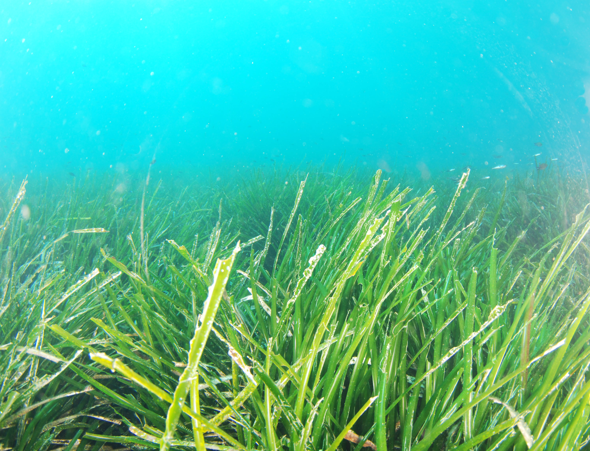
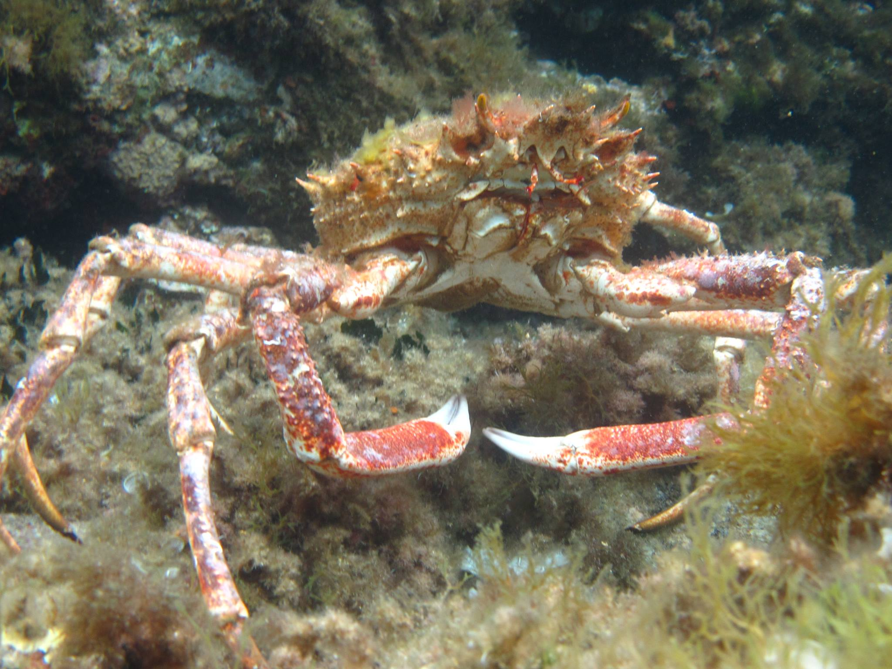

```{r setup, include=FALSE}
knitr::opts_chunk$set(echo = FALSE, warning = FALSE, message = FALSE)
```

# Introduction

L'objectif de cette expérience est tout d'abord d'observer le monde sous-marin de la baie de Calvi, dans un second temps avec l'aide de livre de référence d'identifier un maximum d'espèces animales ou végétales du port de Stareso et de ces alentours proches. La majorité du recensement se réalise en apnée ou de la surface ce qui limite grandement les possibilités d'observation.
Il est coutumier d'entendre que la majorité de la vie aquatique se situe dans une fourchette de 20 à 30 m de profondeur 

La zone de recensement se situe au abord d'un herbier de *Posidonia oceanica* (voir figure \@ref(fig:posido)). Des observations ont montrées que la posidonie était un écosystème très riche et contenait 25% des espèces présentes en Méditerranée.  

```{r posido, fig.cap="Plant de *Posidinia oceanica*"}

```

## Matériel et méthodes

Les matériels utilisés pour réaliser ce recensement d'espèces est du matériels de confort pour de longue durée en mer. Des combinaisons de plongée, des masques, des palmes et des tubas sont mis à disposition pour rendre plus aisée l'observation sous-marine.

Aucune méthode de recensement particulière n'a été employée. 

## Résultats

Les espèces vont être séparée entre la faune et la flore pour simplifier les résultats.

1. la flore:
  + *Posidonia oceanica*
  + *Padina pavonica*
  + *Dictyota linearis*
  + *Halymenia trigona*
  + *Cymodocea nodosa*
  + *Sphaerococcus coronopifolius*
  + *Colpomenia sinuosa*
  + *Acetabularia acetabulum*
  + *Lithophyllum incrustans*
  

2. la faune:
+ *Spongia officinalis*
+ *Halocynthia papillosa*
+ *Pelagia noctiluca*
+ *Holothuria forskali*
+ *Holothuria tubulosa*
+ *Ophiura texturata*
+ *Ophioderma longicauda*
+ *Ophiocomina nigra*
+ *Echinaster sepositus*
+ *Arbacia lixula*
+ *Paracentrotus lividus*
+ *Maja squinado*
+ *Haliotis tuberculata*
+ *Patella vulgata*
+ *Melaraphe neritoides*
+ *Chthamalus depressus*
+ *Monodonta turbinata*
+ *Mytilus sp.*
+ *Octopus vulgaris*
+ *Actinia equina*
+ *Actinia fragacea*
+ *Sabella sp.*
+ *Aiptasia diaphana*
+ *Oblada melanura*
+ *Parablennius gattorugine*
+ *Atherina boyeri*
+ *Coris julis* 
+ *Thalassoma pavo*
+ *Serranus hepatus*
+ *Chromis chromis*
+ *Sarpa salpa*
+ *Scorpaena sp*
+ *Serranus cabrilla*
+ *Diplodus vulgaris*
+ *Labrus bimaculatus*
+ *Muraena helena*
+ *Delphinus sp*

```{r maja, fig.cap="Une photographie de *Maja sp* de Leduc"}

```


Une grande diversité d'organismes a été observée. De nombreux phylum ont été observé tels les échinodermes, chordés, arthropodes... Par exemple, une arraignée de mer s'est retrouvé (voir figure \@ref(fig:maja)) dans le port de la station Stareso.

## Discussions & conclusions

Le nombre d'espèces reconnues parmi la faune et la flore de la baie de Calvi semble faible.  Une explication plausible est le manque de documents, livres de référence, clé d'identification et la mise en place d'une stratégie pour améliorer le recensement devrait être apportée.
