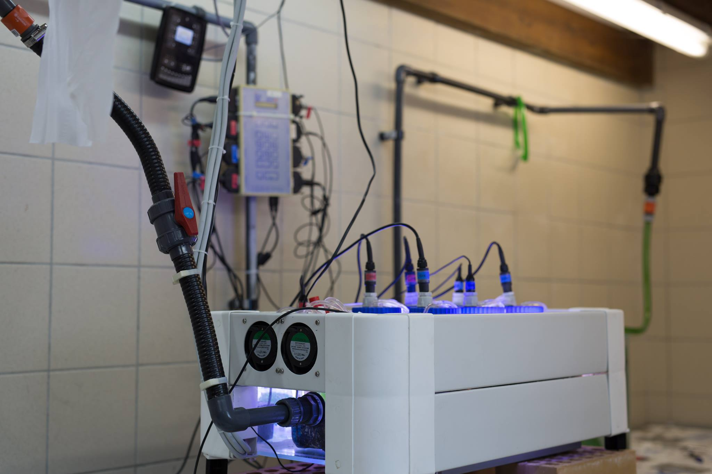
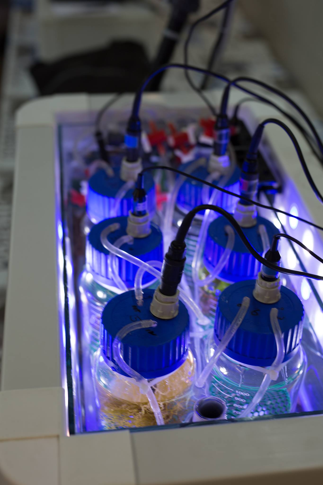

```{r setup, include=FALSE}
knitr::opts_chunk$set(echo = FALSE, warning = FALSE, message = FALSE)
```

# Introduction :

Les expériences de respirométrie sont utilisées pour étudier la concentration en oxygène d'un organisme en fonction du temps.  Des organismes phototrophes ou hétérotrophes sont sélectionnés pour étudier leur utilisation de l'oxygène. Cette manipulation consiste dans la mise en bocal hermétiquement fermé sans phase gazeuse. Cette dernière comporte deux inconvénients majeurs. Tout d'abord, lors de la mise dans le récipient de l'organisme, ce dernier subit un stress pouvant fortement influencer sa consommation d'oxygène. Deuxièmement, tous les organismes ont un métabolisme variable au cours du temps, aussi bien au cours d'une journée que sur une année. Une méthode pour palier à ces deux inconvénients consiste à la réalisation d'un protocole de respirométrie par intermittence. Il s'agit de réaliser des phases de renouvellement de l'eau du bocal et des phases de fermeture du bocal pour en étudier la variation de l'oxygène dans l'eau. Cette méthode permet de maintenir l'expérience sur une plus longue durée. Le non-renouvellement de l'eau sur une trop longue durée induit la mort des organismes.

# Matériel et méthodes :

Six récipients d'un volume 1.3L sont équipés d'une sonde mesurant la concentration en oxygène. La durée de l'expérience est de 48h en continu. La manipulation consiste dans la succession de cylce de 2h. La première heure une pompe injecte de l'eau  et un tuyau de rejet récupère l'excédent dans les récipients pour permettre un renouvellement de l'eau. La seconde heure , la pompe se coupe par un système de minuteur mécanique. L'eau n'est plus renouvellée. Le bilan de l'utilisation de l'oxygène sera étudié lors de la seconde heure du cycle. 

```{r respi1, fig.cap="Une photographie du matériel expériemental de respirométrie"}

```

Cinq espèces sont placées dans un respiromètre different. Le sixième a pour but de renseigner sur la variation d'oxygène provoqué par les microorganismes. L'ensemble des respiromètres est alimenter en eaux de mers directement prélévé dans le port de la station de Stareso. 

Les organismes sont : 

1. *Holothuria forskali* pour 74,85 g de poids frais (1 individu)

2. *Ophiura texturata* pour 2,72 g de poids frais (2 individus)

3. *Patella vulgata* pour 28,37 g de poids frais (3 individus)

4. *Posidonia oceanica* pour 73,83 g de poids frais

5. *Sphaerococcus coronopifolius* pour 21,82 g de poids frais

6. Microorganisme

Les récipients sont remplis entièrement d'eau de mer salée filtrée prélevée directement dans le port de la station Stareso. Les bocaux ne contiennent pas d'air ce qui pourrait influencer la concentration en oxygène dans l'eau suite aux échanges air-eau.  Une puce magnétique est placée dans le fond du récipient pour assurer une agitation constante de l'eau. Pour assurer que la phase de nuit soit complète et pas influencer par l'éclairage du laboratoire une bâche, recouvre les respiromètres la nuit (19h-8h). Le système est monitoré en continu par le biais d'un IKS avec 6 sondes à oxygène (voir figure  \@ref(fig:respi1) et \@ref(fig:respi2)). 

```{r respi2, fig.cap="Une photographie du matériel expériemental de respirométrie"}

```

Une erreur de mesures entre les différents bocaux est corrigée par la mesure de l'oxygène avec un oxymètre de plus haute précision en début de manipulation pour permettre d'appliquer un facteur de correction sur le jeux de données. Chaque heure de non renouvellement de l'eau, une régression linéaire sera réalisée pour modéliser la variation de concentration en oxygène. La valeur de la pente donnera le bilan de l'utilisation de l'oxygène. L'utilisation comprends la consommation et la production en fonction de l'organisme étudié. 

Pour permettre une comparaison entre les différents organismes, le bilan en oxygène sera standardisé pour obtenir le bilan en oxygène pour 1kg d'organismes. Dix régressions linéaires donnant le bilan en oxygène sont employés pour réaliser des statistiques sur l'utilisation en oxygène. Les régressions réalisées lors de problèmes techniques sont rejétées lors de l'analyses.

## Résultats :

A la suite de l'analyse des données obtenues lors de l'expérience, il est observé que le minuteur mécanique allume et éteint la pompe toutes les heures et onze minutes (exemple 8:11). L'expérience commence à 20h11 le 19/04/16 et se boucle à 18h11 le 21/04/16.

```{r, echo=FALSE, message=FALSE, results='hide'}
measure1 <- readRDS("../data/respiro.rds")
```

### *Holothuria forskali* :


```{r holo, echo=FALSE, results='hide', fig.cap= "Variation de la concentration en oxygène (mg/L) au cours du temps L'organisme utilisé est *Holothuria forskali* et a un poids frais de 74.85 grammes"}
plot(measure1$Time, measure1$O2_1N, type = "l",ylab = "concentration en oxygène (mg/L)", xlab="temps", cex.sub = 0.7)
# summary(measure1$O2_1N)
```


La figure \@ref(fir:holo) montre une succession de cycles. Des pics ascendants sont visibles lors de la mise en route de la pompe. La différence de pression engendrée par la mise en route de la pompe influence la mesure en oxygène. Trois grandes dépressions sont observées. Ces dépressions sont liées au fait que l'holothurie va boucher le tuyaux d'arrivée d'eau, empéchant tout renouvellement de l'eau. La seconde dépression montre une capacité de l'organisme à tolérer de fortes réductions en oxygène. 

La moyenne du bilan en oxygène est de 9.563 mg/L. Cette dernière est fortement influencée par la seconde dépression. La médiane est de 10.130 mg/L. Cette seconde information statistique permet de réduire l'effet de l'obstruction des conduits par l'organisme.

### *Ophiura textura* :

```{r ophiura, echo=FALSE, message=FALSE, fig.cap= "Variation de la concentration en oxygène (mg/L) au cours du temps. Les organismes utilisés sont deux *Ophiura textura* et ont un poids frais de 2.72 grammes"}
plot(measure1$Time, measure1$O2_2N, type = "l",ylab="concentration en oxygène (mg/L)", xlab="temps",  cex.sub=0.7)
#summary(measure1$O2_2N)
```

La plus forte dépression est due au blocage de la puce magnétique permettant un renouvellement optimal de l'eau du bocal par les ophiures mis en étude.

Ces organismes ont un métabolisme lent et une faible masse. Le bilan en oxygène ne varie pratiquement pas (voir Figure \@ref(fig:ophiura)). La variation exceptée lors de l'arrêt de la puce ne dépasse pas 1 mg/L. La valeur minimale obtenue est de 9.58 mg/L et la valeur maximale est de 10.69 mg/L. La concentration moyenne en oxygène durant l'expérience est de 10.27 mg/L. 

### *Patella vulgata* :

```{r, echo=FALSE, message=FALSE, fig.cap= "Variation de la concentration en oxygène (mg/L) au cours du temps. Les organismes utilisés sont trois *Patella vulgata* et ont un poids frais de 28.37 grammes."}
plot(measure1$Time, measure1$O2_3N, type = "l",ylab ="concentration en oxygène (mg/L)", xlab="temps", cex.sub=0.7)
#summary(measure1$O2_3N)
```

Une augmentation de l'activité métabolique des 3 *Patella vulgata* est observée à partir du second jour de l'expérience. La concentration moyenne en oxygène est de 9.911 mg/L. 

### *Posidonia oceanica* :

```{r posido, echo=FALSE, message=FALSE, fig.cap= "Variation de la concentration en oxygène (mg/L) au cours du temps. Les organismes utilisés sont des *Posidonia oceanica* et ont un poids frais de 73.83 grammes."}
plot(measure1$Time, measure1$O2_4N, type = "l",ylab="concentration en oxygène (mg/L)", xlab ="temps", cex.sub=0.7)
#summary(measure1$O2_4N)
```

La valeur moyenne de concentration en oxygène est de 10.610 mg/L. Cet organisme photosynthétique produit de l'oxygène lorsqu'il est éclairé. La valeur maximale est de 18.750 mg/L. Cette dernière est obtenue après plusieurs heures d'éclairage. Le brassage n'est pas suffisant pour remettre la concentration en oxygène à des valeurs observables dans le milieu naturel. La phase jour et nuit est observable la succession de haute concentration en oxygène sont suivi de succession de très faible concentration en oxygène.

### *Sphaerococcus coronopifolius* :

```{r, echo=FALSE, message=FALSE, fig.cap= "Variation de la concentration en oxygène (mg/L) au cours du temps. Les organismes utilisés sont des *Sphaerococcus coronofolius* et ont un poids frais de 21.83 grammes."}

plot(measure1$Time, measure1$O2_5N, type = "l",ylab ="concentration en oxygène (mg/L)", xlab ="temps", cex.sub=0.7)
#summary(measure1$O2_5N)
```

La valeur minimale mesurée est de 2.768 mg/L et la valeur maximale est de 19.350 mg/L. La succesion de phase jour et nuit est observée comme pour *Posidonia oceanica*. La sonde à oxygène est saturé durant plusieurs heures.  

### Microorganismes :

```{r, echo=FALSE, message=FALSE, fig.cap= "Variation de la concentration en oxygène (mg/L) au cours du temps. Les organismes utilisés sont des microorganismes."}

plot(measure1$Time, measure1$O2_6N, type = "l",ylab="concentration en oxygène (mg/L)", xlab="temps", cex.sub=0.7)
#summary(measure1$O2_6N)
```


La concentration moyenne en oxygène est de 10.060 mg/L. La valeur minimale est de 9.719 mg/L et la valeur maximale est de 10.660 mg/L. La différence entre la valeur maximale et la valeur minimale est de moins d'1 mg/L. Cette analyse permet de corriger les expériences précedentes et de ne pas introduire un biais dans nos analyses sur les macroorganismes.

### Bilan en oxygène des différents organismes étudiés: 

L'indice employé exprime l'utilisation de l'oxygène standardisé sur une masse d'un kilogramme d'organismes. La mesure est prise dans l'eau du récipient.

```{r, echo=FALSE, warning=FALSE, message=FALSE}
csvread <- function(file, header = "auto", na.strings = "NA", nmax.factors = 10,
nrows = -1L, skip = -1L, autostart = 30L, integer64 = "numeric", ...) {
  ## Read the data from a CSV file
  df <- readr::type_convert(data.table::fread(file, header = header,
    na.strings = na.strings, nrows = nrows, skip = skip, autostart = autostart,
    integer64 = integer64, ...))
  ## Convert character into factor if n unique levels <= nmax.factors
  string_as_factor <- function(x, nmax) {
    if (is.character(x) && length(levels <- unique(x)) <= nmax)
      factor(x, levels = levels) else x
  }
  if (nmax.factors > 0)
    df <- lapply(df, string_as_factor, nmax = nmax.factors)
  dplyr::tbl_df(as.data.frame(df))
}
respirointmoy1 <- csvread("../data/raw/respirointmoy1.csv")
# importation d'un jeux de données contenant 10 bilans en oxygène pour chaque organismes testé
#summary(respirointmoy1)
```

```{r respisum, echo=FALSE}
knitr::kable(summary(respirointmoy1), caption = "Tableau récaputilatif des bilans en oxygène des différents organismes. Il comprend les valeurs minimales, les premiers quartiles, les médianes, les moyennes, les troisièmes quartiles et les valeurs maximales. Les variables portent les abréviations suivantes bilan (BIL), oxygène(OX) et le noms de l'organisme l'holothurie (HOLO), l'ophiure (OPH), la patelle (PAT), la posidonie (POS) et l'algue (SPH).")
```

Les organismes hétérotrophes consomment en permanence de l'oxygène. A la fermeture de la pompe, la concentration en oxygène diminue à chaque fois. Les organismes phototrophes ont un bilan en oxygène très différent et tenant compte de l'éclairage. L'organisme obtenant les valeurs les plus extrêmes est *Sphaerococcus coronopifolius*. 

## Discussion & conclusions :

L'expérience de respirométries est à considérer comme une expérience préliminaire servant de calibration pour corriger les problèmes matériels. L'expérience sur *Holothuria forskali* devrait être réalisée en démultipliant les arrivées d'eau de la pompe pour empêcher l'organisme de les boucher. L'expérience de *Ophiura textura* devrait se dérouler dans un récipient plus petit. Il faut aussi protéger la puce avec un grillage fixé pour empêcher l'organisme de passer sous le grillage. Le blocage de cette puce empêche une bonne circulation de l'eau. L'eau n'est donc plus renouvellé efficacement.  L'expérience de *Posidonia oceanica* devrait être réalisée avec une masse plus faible de cet organisme ou dans un récipient plus grand avec un brassage d'eau plus important. L'expérience de *sphaerococcus coronopifolius* devrait obtenir les mêmes corrections que pour *P.oceanica*. Les données obtenues avec l'holothurie et les 2 ophiures sont biaisées par les problèmes techniques. Une nouvelle expérience rendra la discussion plus intéressante.

Les données standardisées permettent de comparer efficacement les organismes. Les *sphaerococcus coronopifolius* ont une capacité de production en oxygène nettement supérieur à *Posidonia oceanica* (voir Tableau \@ref(tab:respisum)). La valeur maximale de l'algue est plus de 6 fois supérieure à la valeur maximale de la plante supérieure. Les informations statistiques basiques comme la moyennes, médianes... fournies pour les organismes phototrophes n'apportent aucune information. Le cycle jour/nuit biaise ces données.  Inversement, la moyenne et la médiane fournies pour les organismes hétérotrophes apporte une véritable information non-biaisée par le cycle jour/nuit. L'organisme qui a la plus haute activité métabolique à poids standardisé est  *Patella vulgata*.

Ce système de respirométrie ne peut réellement rendre compte de l'activité de l'organisme. Les organismes vivent dans la mer. Il est impossible de reproduire fidèlement les conditions de vie des organismes. 

Les nombreux problèmes techniques rendent l'analyse des résultats compliqués. Cette expérience est à prendre comme une expérience préliminaire permettant de réaliser les réglages techniques de l'expérience. 

Cette expérience de respirométrie par intermittence est une amélioration de l'expérience de base. 
