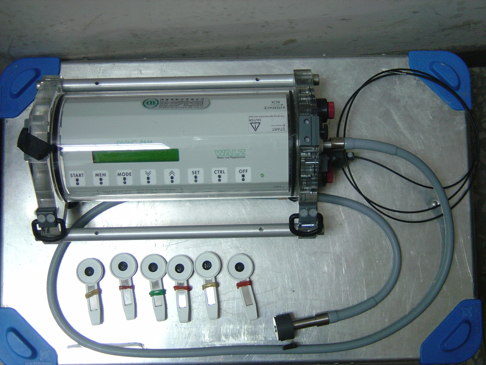

```{r setup, include=FALSE}
knitr::opts_chunk$set(echo = FALSE, warning = FALSE, message = FALSE)
```

# Introduction :

L'expérience de biométrie met en évidence la capacité de croissance et la bonne santé de l'herbier.

Cette expérience peut être découpée en différentes étapes : mesure de la capacité photosynthétiques avec le diving Pam (Pulse Amplitude  modulated) in situ et en laboratoire, mesure des plants, pesée des plants et des épiphytes.

Tout d'abord, des mesures avec le Diving PAM vont mettre en évidence la fluorescence d'organismes photosynthétiques. Différentes mesures sont réalisées sur des plants de *Posidonia oceanica* à 3 mètres, 15 mètres et 30 mètres. Ils sont prélevés par la suite et remontés en laboratoire. La seconde partie sera une expérience inédite.  Il s'agit de compararer les mesures effectuées in situ et les valeurs obtenues en laboratoire. 

Différentes mesures sont réalisées sur les feuilles des plants prélevés. L'ensemble des ces indices informe sur la biométrie et la bonne santée de la posidonie.

# Matériels et méthodes :

Trois sites d'échantillonnages à des profondeurs distinctes sont sélectionnés : 3, 15, 30 mètres. Six plants sont sélectionnés aléatoirement et découpés à 1 cm des écailles de la plante. Dix pousses seront prélevées à 15m. 

Des mesures avec le Diving Pam (voir figure \@ref(fig:pam)) in situ vont être réalisées sur les plants prélevés à 3 mètres.  Ensuite, les plants vont être remontés en surface et de nouvelles mesures vont être réalisées en laboratoire sur l'ensemble des plants. Des graphiques de courbes lunineuses (light curve) vont être générés montrant le taux de transfert des électrons quantifiant l’activité photosynthétique (ETR) en fonction de la radiation photosynthétique active (PAR appliquée).

```{r pam, fig.cap="Une photographie du Diving PAM"}

```


La longueur et la largeur de chaque feuille de chaque plant vont être mesurées. D'autres indices vont être notifiés comme la présence de feuilles mangées, la présence d'épiphytes... Chaque plant est pesé après prélèvement et après passage dans une étuve. Les épiphytes sont également prélevés et pesés avant et après passage à l'étuve. Pour obtenir de plus amples informations, les plants vont être séparés en fonction de leur profondeur et comparés pour rendre compte de la possible différence de croissance.

Des analyses statistiques vont permettre de démontrer si les observations graphiques sont significatifs. Le premier choix sera d'utiliser un test paramétrique comme une analyse de la variance (ANOVA) qui est la généralisation d'un test de student de comparaison des moyennes. Ce test permet de montrer si différentes sous-populations sont significativements similaire ou non. Pour ce faire, deux conditions doivent être remplies qui sont l'homoscédasticité des valeurs et la distribution normale des résidus. Un test non-paramétrique sera employé si les conditions ne sont pas respectées. Un test de Kruskal-Wallis, qui est la généralisation d'un test de Mann Whitney, est le penchant non-paramétriques de l'ANOVA. 

# Résultats :

```{r}
library(dplyr)
BIOMETRIE_POSIDONIE <- read.csv2("../data/raw/BIOMETRIE_POSIDONIE.csv")

# summary(BIOMETRIE_POSIDONIE)
## premier résumé pour observer la tête du jeux de données 

BIOMETRIE_POSIDONIE1 <- BIOMETRIE_POSIDONIE[ , c("longueur..mm.","largueur..mm.","surface..mm..", "indice.A", "epiphyte")]
# summary(BIOMETRIE_POSIDONIE1)

```

Le tableau \@ref(tab:posidotab) indique une grande disparité pour la longeur des feuilles. La valeur minimale est de 14 millimètres et la valeur maximale 942 millimètres. A l'opposé, la largeur des feuilles de posidonie reste pratiquement constant tout au long de la croissance de cette dernière.

```{r posidotab}
knitr::kable(summary(BIOMETRIE_POSIDONIE1), caption = "Tableau relatant les valeurs minimales, premiers quartiles, médianes, moyennes, troisièmes quartiles et maximales de la longueur, largeur et surface en millimètres de chaque feuille de *Posidonia oceanica*. Deux indices sont utilisés pour exprimer le broutage des feuilles (A=Brouté, X=non brouté) et la présence d'epiphyte.")
```


Les valeurs maximales de la longueur mesurées (voir Figure \@ref(fig:posidobio) A) en fonction de la profondeur donne une indication sur la croissance des plants. La valeur la plus faible est mesurée à 30 mètres avec une longueurs de 399 millimètres. La valeur la plus haute est mesurée à 15 mètres avec une longueur de 942 millimètres. La valeur à 3 m est de 739 millimètres. La largeur des feuilles (voir Figure \@ref(fig:posidobio) B) de *Posidonia oceanica* ne varie que peut durant la croissance de la feuille. Les feuilles les plus petites et les plus grandes ont une largueur de feuilles similaires. L'écart maximale entre la feuille plus étroite et la plus large est de 3 millimètres peut importe la profondeur d'échantillonage. 

```{r posidobio, fig.cap="Boites de dispersion de la longueur (A), la largeur (B) et la surface(C) des feuilles des plants de *Posidonia oceanica* en fonction de la profondeur de prélèvements (3,15,30 mètres)."}
par(mfrow = c(2,2))
boxplot(longueur..mm.~Profondeur,data = BIOMETRIE_POSIDONIE, xlab= "Profondeur (m)", ylab= "Longueur (mm)", main = "A" , cex.main = 0.9)
boxplot(BIOMETRIE_POSIDONIE$largueur..mm.~BIOMETRIE_POSIDONIE$Profondeur,data = BIOMETRIE_POSIDONIE, xlab= "Profondeur (m)", ylab = "Largeur (mm)", main = "B", cex.main = 0.9)
boxplot(BIOMETRIE_POSIDONIE$surface..mm..~BIOMETRIE_POSIDONIE$Profondeur,data = BIOMETRIE_POSIDONIE, xlab= "Profondeur (m)", ylab = "Surface (mm²)", main = "C", cex.main = 0.9)
par(mfrow = c(1,1))

#aggregate(BIOMETRIE_POSIDONIE$longueur..mm.~BIOMETRIE_POSIDONIE$Profondeur, FUN=summary)
#aggregate(BIOMETRIE_POSIDONIE$longueur..mm.~BIOMETRIE_POSIDONIE$Profondeur, FUN=summary)
#aggregate(BIOMETRIE_POSIDONIE$largueur..mm.~BIOMETRIE_POSIDONIE$Profondeur, FUN=summary)
#aggregate(BIOMETRIE_POSIDONIE$surface..mm..~BIOMETRIE_POSIDONIE$Profondeur, FUN=summary)
```

